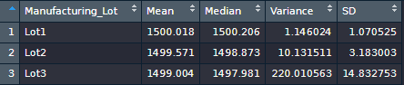
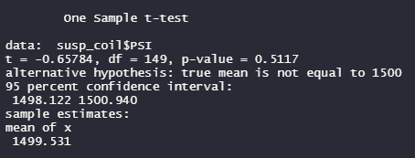
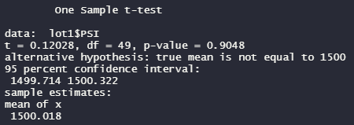
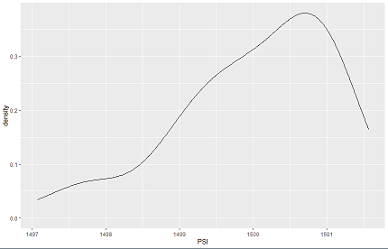
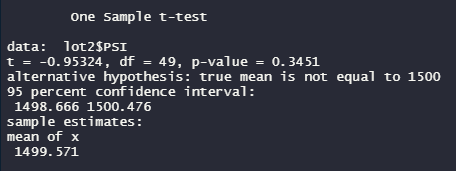
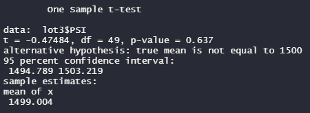
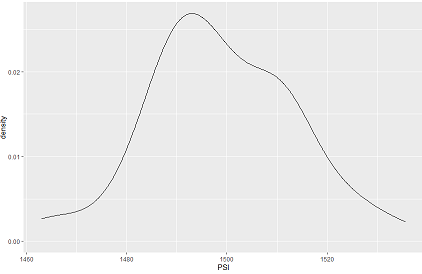
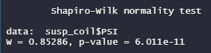
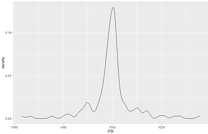

# MechaCar Statistical Analysis

​	

AutosRUs’ newest prototype, the MechaCar, is suffering from production troubles that are blocking the manufacturing team’s progress. This is an exploratory analysis to pinpoint the problems in order to find solutions. 

### Linear Regression to Predict MPG

​	To predict the effect of each variable in the given dataset on the MPG rating of the new MechaCar, I performed a multiple linear regression model. For the model, the null and alternative hypotheses are:

- H0 : The slope of the linear model is 0, indicating that there is no significant linear relationship.

- Ha: The slope of the linear model *is not 0*, indicating a linear relationship between at least some of the variables. 

The resulting output can be seen in the screenshot below. 

​	In this test, the significant variables are the vehicle length and ground clearance, as well as the intercept. These provide a non-random amount of variance to the MPG values in the dataset. Because they are significant, we can reject the null hypothesis, meaning that the slope of the model is not 0 and that there *is* a relationship between at least some of the variables and the MPG measurement. Despite this, our model doesn't provide a completely accurate prediction of MPG. The R2 value is 0.71, which indicates a strong correlation, but as we can see there are factors included which don't significantly influence the outcome. In addition, the intercept being significant indicates that there are other variables and factors that contribute to the variation that have not been included in the model. 

### Summary Statistics on Suspension Coils

​	The design specifications for the MechaCar state that the variance of the suspension coils <u>must not exceed</u> 100 pounds per square inch. To ensure that this specification is being adhered to, I created data frames containing the summary statistics on suspension coil data from three different manufacturing lots, pictured below. 

This table of the dataset overall shows only 76.2 pounds per square inch over all manufacturing lots, which is promising. However, upon closer inspection through grouping the lots together:

Lots 1 and 2 show quite a low variance compared to Lot 3, which shows more than twice the maximum allowable variance. This vast difference in values explains why the overall measure looks acceptable while the true results are not.  

### T-Tests on Suspension Coils

​	 To further investigate the manufacturing problems with PSI, I completed a series of  one-sample T-Tests to look for differences in distribution among samples and the population. For each test the hypotheses are as follows:

- H0: There is no significant statistical difference between the observed sample mean and the population mean of 1500. 
- Ha: There *is* a significant statistical difference between the observed mean and the population mean. 

The first test compares the overall sample mean from all lots with the given population mean of 1500 PSI. The resulting output is shown below:

The p-value calculated by this test is 0.5 which is *not* significant compared to the alpha of 0.05. Thus, I fail to reject the null hypothesis, meaning that any differences between the overall sample mean and the population mean are the result of random chance rather than external factors. 

​	Following that, I decided to test a subset of the samples, grouped by Manufacturing Lot, against the population mean of 1500. The resulting p-value from each of the three tests is greater than our alpha value of 0.05. Thus, in every case, we fail to reject the null hypothesis. Any difference between the sample and population mean PSI must be due to random chance.  I thought this was slightly strange because of the vast difference in the variance displayed in the above tables, so I decided to take a look at a visualization of each lot, which brought up some interesting questions. The T-Test results and visualizations for all 3 lots are below:

 

The visualizations make it clear that Lot 1's measurements are fairly skewed to the left, despite the mean and median being quite similar, and the density is an order of magnitude larger than the other two.  I decided to look further into the assumptions made at the beginning of this analysis. All testing done on the suspension coil metrics has been performed on the assumption that the data is approximately normal with a similar variance across groups.  It was clear from the first summary of the PSI data that the variance shows great differences across groups, but with no hypothetical population comparison, I continued exploring. Based on these results, however, I decided to test the full dataset for normality, both quantitatively and qualitatively.

 

 

Both of these tests clearly indicate that the dataset is not normally distributed. The Shapiro-Wilk normality test produces a p-value much smaller than 0.05, which is *not* a good thing in this case, and the visualization lacks the typical "bell curve" shape. Because of these discoveries, additional testing must be performed that is more applicable to the dataset. [^1]	

### Study Design: MechaCar vs. the Competition

To compare the performance of the MechaCar against its competitors, I would gather a fair amount of additional data from numerous sources, including market surveys and manufacturer information. I would mainly be looking at the following metrics:

- Highway Fuel Efficiency (MPG) 
- City Fuel Efficiency (MPG) 
- Average Engine Life (months before any engine repair) 
- Horsepower
- Market Saturation
- Popularity Rating

These metrics would be used to perform a few different tests, based on different aspects of what one might consider "performance." 

##### Distribution Assessment and Normalization

The first thing I would do would be to test for normality cross the distribution of the sample data collected. If the data passed the Shapiro-Wilk Normality Test, I would just move on to the next set of tests. If it didn't, I would attempt to see if I could transform the data into a normal distribution using a log-transform. If the data was still unable to approximate a normal distribution, I would return to the collection phase. However, for the purposes of this design, we will assume that the sample size is sufficient, the data approximates a normal distribution, and there is not a large amount of variance between groups. 

##### T-Testing

The next phase of testing would compare the means between samples and populations, as well as between samples, using the Average Engine Life and both City and Highway Fuel Efficiencies. 

I would begin by performing a two-sided, one sample T-Test to discern whether there is a significant difference in performance between the MechaCar and the population of comparable vehicles using each of the metrics . For these tests the hypotheses would be as follows:

- H0: There is no significant statistical difference between the mean < Metric > of the MechaCar and that of the population. 
- Ha: There is a significant difference between the mean < Metric > of the MechaCar and the population mean. 

where < Metric > is replaced by Average Engine Life, City Fuel Efficiency, or Highway Fuel Efficiency. If the results allowed us to reject the null hypothesis that there was no significant difference, I would then perform additional two-sided, one-sample T-tests for each metric on specific competitor cars to discern which of those also showed a significant difference when compared to the population. 

Next, I would do two-sided, two-sample t-tests between the MechaCar and the competitors that showed significant differences compared to the population. These would be two-sample and two-sided because I would be comparing two samples from the same population for any difference. For these tests the hypotheses would be:

- H0: There is no statistically significant difference between the mean < Metric > of the MechaCar and that of the < Competitor >.
- Ha: There is a significant difference between the mean < Metric > of the MechaCar and the < Competitor >.

where < Metric > is replaced by Average Engine Life, City Fuel Efficiency, or Highway Fuel Efficiency, and < Competitor > is replaced with the name of a competitor that passed the initial one-sample T=Test. 

If the two-sample tests showed a significant difference, I would then perform one-sided, two-sample tests to discern whether the difference between the MechaCar and each competitor is positive. For these tests the hypotheses would be:

- H0: There is no statistically significant difference between the mean < Metric > of the MechaCar and that of the < Competitor >.
- Ha: The mean < Metric > of the MechaCarThere is significantly higher than that of the < Competitor >.

where < Metric > is replaced by Average Engine Life, City Fuel Efficiency, or Highway Fuel Efficiency, and < Competitor > is replaced with the name of a competitor that showed significant differences in the two-sample T=Test.

In this test, we would be looking for a specific outcome of more miles per gallon or more months before any engine repair. Thus, we use a one-sided T-Test. From this information, we could confidently say whether the performance of the MechaCar is better than (at least some of) its competitors. 

##### Linear Regression Model

The second phase of testing I would perform would be two linear regression models showing the effect (if any) of all of the collected metrics in relation to popularity ratings and market saturation. Basically, I would be testing for whether the horsepower, the city or highway fuel efficiency, and/or the average engine life have a significant effect on either popularity rating or the number of each car that has been purchased (within the appropriate target market) within a given amount of time. I would do this through a multiple linear regression model looking for significance between the dependent variable (popularity rating or market saturation) and the independent variables. This would essentially indicate which of the independent variables show a significant effect on the dependent variables, providing weights for a predictive analysis on the potential popularity and purchase numbers for the MechaCar, particularly where it showed a significant positive difference in the T-Tests. 

[^1]: Note: I would normally test for normality before doing a number of tests based on normal assumptions. However, I was following the structure of an exercise, assuming that the dataset provided would be a good fit for the tests required. Additionally, the new study design does not address these concerns, but does attempt to avoid them by gathering new data. 

