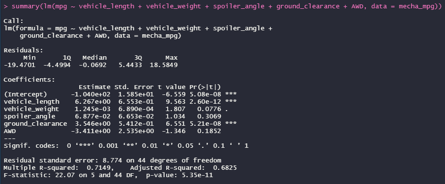

# MechaCar Statistical Analysis

### Linear Regression to Predict MPG

​	To predict the effect of each variable in the given dataset on the MPG rating of the new MechaCar, I performed a multiple linear regression model. For the model, the null and alternative hypotheses are:

- H0 : The slope of the linear model is 0, indicating that there is no significant linear relationship.

- Ha: The slope of the linear model *is not 0*, indicating a linear relationship between at least some of the variables. 

The resulting output can be seen in the screenshot below. 

​	In this test, the significant variables are the vehicle length and ground clearance, as well as the intercept. These provide a non-random amount of variance to the MPG values in the dataset. Because they are significant, we can reject the null hypothesis, meaning that the slope of the model is not 0 and that there *is* a relationship between at least some of the variables and the MPG measurement. Despite this, our model doesn't provide a completely accurate prediction of MPG. The R2 value is 0.71, which indicates a strong correlation, but as we can see there are factors included which don't significantly influence the outcome. In addition, the intercept being significant indicates that there are other variables and factors that contribute to the variation that have not been included in the model. 

